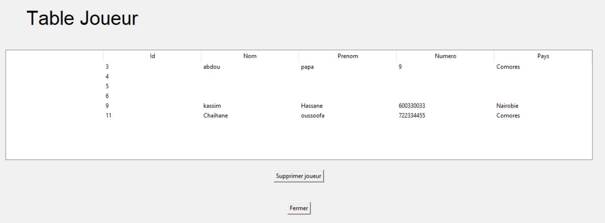

<h2 align="center">Bonjour dans mon application bureautique STANIA, dévelopé</h2>
  
  
# Mon Application Tkinter

Cette application est développée en Python en utilisant la bibliothèque Tkinter pour l'interface graphique. Ce document vous guidera à travers les étapes nécessaires pour lancer l'application en local sur votre machine.

## Prérequis

Avant de lancer l'application, assurez-vous d'avoir les éléments suivants installés :

1. **Python 3.x** : Vous pouvez télécharger la dernière version de Python depuis [python.org](https://www.python.org/downloads/).

2. **Bibliothèques Python** : Les bibliothèques nécessaires pour exécuter l'application doivent être installées. Si votre application utilise des bibliothèques supplémentaires autres que Tkinter, assurez-vous de les mentionner dans le fichier `requirements.txt` ou d'inclure des instructions pour les installer.

## Installation

1. **Clonez le dépôt** (si l'application est hébergée sur GitHub) :

   ```bash
   git clone https://github.com/votre-utilisateur/votre-repository.git
   cd votre-repository
e avec Tkinter en Python</h2>

# II - Execution de l'application Tkinter


<br>

<br>

<br>

<br>



